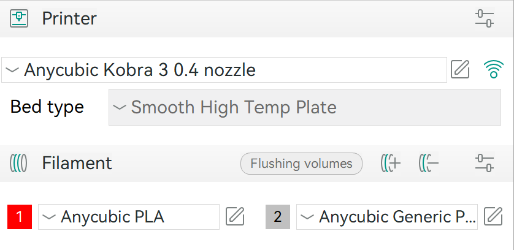

<h2>3D Printing using Orca Slicer (software app) and the Anycubic Kobra 3 Printer (hardware)</h2>

The slicing software creates instructions for how to print an object for a particular printer. On the Mac workstations in the History Tech Lab, the software is set to default to the printer we have: the Anycubic Kobra 3. If you want to slice a model on your own computer, choose the correct version of Orca to download by visiting <a href="https://github.com/SoftFever/OrcaSlicer/releases">their Github page</a>. You can choose which of the four loaded filaments you want to use for your print. Watch these videos for helpful step-by-step tutorials.

Orca Video

<iframe width="1000" height="526" src="https://www.youtube.com/embed/cquTCpz1V74" title="Orca Slicer getting started guide: A slicer for all of your 3D printers" frameborder="0" allow="accelerometer; autoplay; clipboard-write; encrypted-media; gyroscope; picture-in-picture; web-share" referrerpolicy="strict-origin-when-cross-origin" allowfullscreen></iframe>  

Anycubic Video

<iframe width="1000" height="526" src="https://www.youtube.com/embed/2CurchA4HT8" title="AnyCubic Tries Multicolor: The AnyCubic Kobra 3 Combo" frameborder="0" allow="accelerometer; autoplay; clipboard-write; encrypted-media; gyroscope; picture-in-picture; web-share" referrerpolicy="strict-origin-when-cross-origin" allowfullscreen></iframe>

<h2>Tips for Preparing the Print File</h2>
+ Open the Orca Slicer application and ensure that the Anycubic Kobra 3 printer is selected. The printer settings should look like the below screenshot.
<figure>
    
</figure>
+ Import an STL file. 
+ After rotating it and snapping it to the build plate, it should look like what you see in the image below.
<figure>
    
</figure>              

+ Adjust the dimensions and any other print settings.
+ Then click 'Sice plate' at the top of the screen. 
+ Make sure that the file is saved in the file type '.gcode' and after the slicing completes it should look like the image below.
<figure>
    
</figure>  

<h2>Starting the Print</h2>

+ Save the .gcode file to a USB drive and then insert that drive into the port on the Anycubic Kobra 3 printer. 
+ Before printing, check:
  1. That the nozzle is clear of any filament buildup
  2. That the tubes do not contain any breaks in the filament
+ Use the touchpad to select your print file from the USB drive.
+ Watch the printing for at least the first two layers of the object.
+ Cancel the print if:
  1. The filament fails to load
  2. The filament begins to bubble over the nozzle
  3. The filament fails to adhere to the build plate
+ After the first two layers have printed successfully, you can leave the printer and return when the print is completed.
+ Make a note to yourself, such as through setting a reminder on your phone, when to return to pick up the completed print and turn off the printer. 
