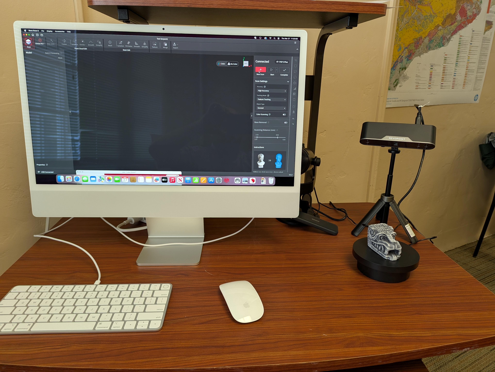
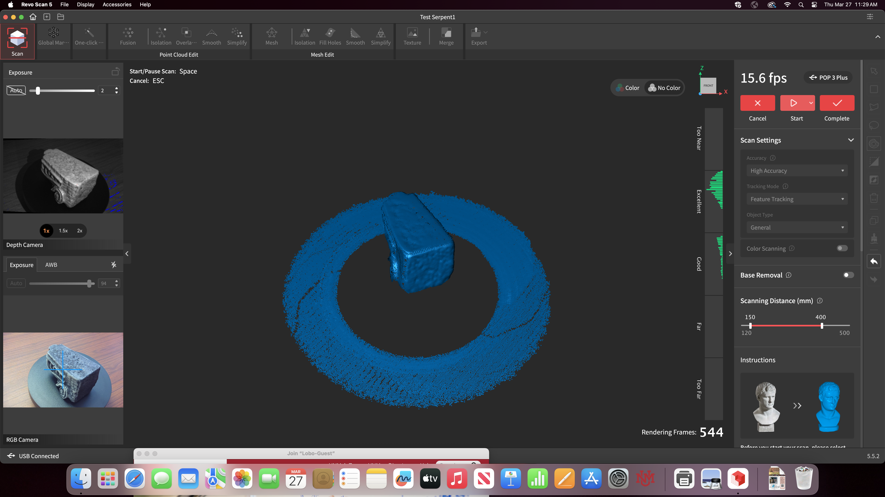
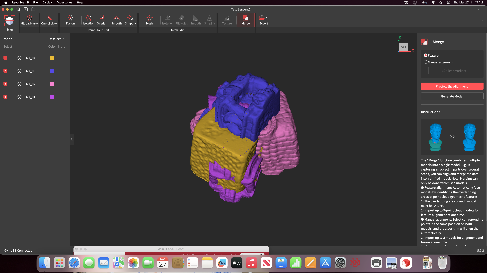

<h2>3D Scanner: Revopoint POP3</h2>

The following information guides users through some of the basic steps and troubleshooting for using the 3D scanner available in the History Tech Lab. For a full step-by-step explanation, watch the below video.  
Video on the Revopoint POP3

<iframe width="853" height="480" src="https://www.youtube.com/embed/YNpmpQmFLzo" title="Revopoint POP3 Review - 3D Scanner" frameborder="0" allow="accelerometer; autoplay; clipboard-write; encrypted-media; gyroscope; picture-in-picture; web-share" referrerpolicy="strict-origin-when-cross-origin" allowfullscreen></iframe> 
For more information about the Revopoint POP3 scanner and software, visit their <a href="https://support.revopoint3d.com/hc/en-us">online support documentation</a>.

<h2>Tips for 3D Scanning</h2>
+ Open the Revoscan application on the computer and connect the scanner through its USB cable. The setup should look like the picture below.
<figure>
    
</figure>  
Scanning Every Surface
+ After completing separate scans for each rotated side of the object, you will have multiple scan files listed on the lefthand side of the application screen.
+ Go through each of these and delete unwanted material. In the example in the picture below, we would next delete the ring around the base of the object.
<figure>
    
</figure>  
Fusion and Merging
+ Click through the Fusion instructions for each of the scans.
+ Once fused, the multiple scans can then be merged.
+ Check that enough of the model (over 30%) overlaps, such as in the image below.
<figure>
    
</figure>  
Merging and Exporting the Model
+ Click 'Generate Model.'
+ After merging, you can create the Mesh for the object.
+ Check your object for holes to fill erroneous extra material.
+ Choose which type of file format for your Export:
  1. For 3D printing, export in STL format
  2. For viewing in 3D in a virtual environment on the internet, choose GLTF format
   
